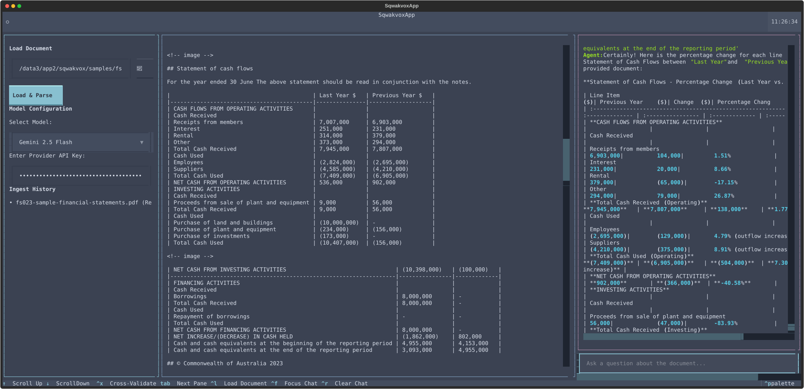

# Sqwakvox — Local AI Financial Document Assistant

```
███████╗ ██████╗ ██╗    ██╗ █████╗ ██╗  ██╗██╗   ██╗ ██████╗ ██╗  ██╗
██╔════╝██╔═══██╗██║    ██║██╔══██╗██║ ██╔╝██║   ██║██╔═══██╗╚██╗██╔╝
███████╗██║   ██║██║ █╗ ██║███████║█████╔╝ ██║   ██║██║   ██║ ╚███╔╝ 
╚════██║██║▄▄ ██║██║███╗██║██╔══██║██╔═██╗ ╚██╗ ██╔╝██║   ██║ ██╔██╗ 
███████║╚██████╔╝╚███╔███╔╝██║  ██║██║  ██╗ ╚████╔╝ ╚██████╔╝██╔╝ ██╗
╚══════╝ ╚══▀▀═╝  ╚══╝╚══╝ ╚═╝  ╚═╝╚═╝  ╚═╝  ╚═══╝   ╚═════╝ ╚═╝  ╚═╝
```

[](https://python.org)
[](LICENSE)

Sqwakvox is a terminal user interface application for financial document analysis. It uses IBM Docling to read PDF files and render tables with sparkline trends. It connects to language models through Mozilla any-agent. It includes prompt guardrails, PII redaction, and numerical cross-validation.



## Features

- **3-Pane TUI**: The interface has a sidebar, a document render pane, and a chat log.
- **Docling Integration**: The application parses local PDF files and remote URLs. It exports table data to dataframes.
- **Multi-Model Support**: The application connects to OpenAI, Anthropic, Mistral, and Gemini models.
- **Input Guardrails**: Mozilla `any-guardrail` blocks prompt injection attacks before queries reach the model.
- **PII Redaction**: The system redacts Social Security numbers, credit cards, bank accounts, and email addresses.
- **Financial Cross-Validation**: The rule engine extracts numeric table values and verifies calculated results.
- **OpenTelemetry Instrumentation**: The system records traces and metrics for document processing, agent execution, and tool calls.
- **Unicode Table Rendering**: The application displays double borders, automatic column alignment, and numeric sparklines.
- **Audit Logging**: The application writes events to an append-only JSONL audit log.

## Architecture

Sqwakvox uses a model-view-presenter (MVP) layout decoupled by Celery. The
Textual TUI (view) never blocks on heavy work — it submits Celery tasks through
the presenter and polls for progress, while a separate worker process runs
document ingestion, cross-validation, and agent execution.

```
┌─────────────────────────────────────────────────────────────┐
│                    View — Textual TUI (app.py)               │
│  3-pane interface: sidebar / document render / chat log      │
└──────────────────────────┬──────────────────────────────────┘
                           │ submit + poll (AsyncResult)
                           ▼
┌─────────────────────────────────────────────────────────────┐
│            Presenter (presenter.py)                          │
│  async facade: TaskHandle, callbacks, revoke, wait()         │
└──────────────────────────┬──────────────────────────────────┘
                           │ Redis broker + result backend
                           ▼
┌─────────────────────────────────────────────────────────────┐
│        Backend — Celery worker (run_worker.py)               │
│  sqwakvox.backend.tasks → AppController (controller.py)      │
│  Docling │ Financial Rule Engine │ any-agent + guardrails    │
└─────────────────────────────────────────────────────────────┘
```

### Running the backend

The TUI and the worker are separate processes connected by a Redis broker.
Start Redis, then the worker, then the TUI:

```bash
# Terminal 1 — Celery worker
python -m sqwakvox.run_worker
# or with uv: uv run python -m sqwakvox.run_worker

# Terminal 2 — TUI
sqwakvox
```

The broker and result-backend default to `redis://localhost:6379`. Override
them with `SQWAKVOX_CELERY_BROKER` and `SQWAKVOX_CELERY_BACKEND`. For offline
testing (no Redis), set `SQWAKVOX_CELERY_EAGER=1` to run tasks in-process.

## Installation

Install the package with pip:

```bash
pip install sqwakvox
# or from source:
pip install -e .
```

This application requires Python 3.12 or higher.

## Usage

Run the application:

```bash
sqwakvox
```

Follow these steps to analyze a document:

1. If you have a local file or URL, enter the path in the input field or click the browse button.
2. Select a model provider from the dropdown menu.
3. Enter your API key for the selected provider.
4. Click **Load & Parse** to extract layout, text, and tables.
5. Enter a question in the chat input.

### Keybindings

| Key | Action |
|-----|--------|
| `q` | Quit |
| `Ctrl+L` | Focus document source input |
| `Ctrl+F` | Focus chat input |
| `Ctrl+R` | Clear chat log |
| `Tab` | Cycle through panes (source → render → chat) |
| `Up/Down` | Scroll focused pane |
| `Ctrl+X` | Run numerical cross-validation on loaded tables |

## Configuration

You enter API keys in the sidebar at runtime. The application does not store your keys.

You can set these environment variables instead of entering keys in the sidebar:
- `OPENAI_API_KEY`
- `ANTHROPIC_API_KEY`
- `MISTRAL_API_KEY`
- `GEMINI_API_KEY`

## Guardrails & Safety

1. **Prompt Injection**: `any-guardrail` inspects every user query before the model receives the text.
2. **PII Redaction**: The redactor strips Social Security numbers, credit card numbers, IBANs, and email addresses from user queries and model responses.
3. **Numerical Cross-Validation**: The `FinancialRuleEngine` extracts labelled numbers from document tables and verifies model calculations.
4. **Audit Logging**: The application writes timestamped logs to `~/.gemini/antigravity/sqwakvox/audit_log.jsonl`.

## OpenTelemetry & Performance Monitoring

Sqwakvox records OpenTelemetry traces and performance metrics.

### Traces & Spans

- `sqwakvox.document.convert`: Measures document parsing latency and file size.
- `sqwakvox.agent.execute`: Tracks agent query latency, execution duration, and prompt length.
- `sqwakvox.guardrail.validate_prompt`: Records prompt validation latency and results.
- `sqwakvox.guardrail.redact_pii`: Records PII redaction duration and detected items.
- `sqwakvox.cross_validate`: Measures table column sum validation time.
- `sqwakvox.mcp_tool.<tool_name>`: Records execution time and status for MCP tools.

### Metrics

- `sqwakvox.document.ingest.duration`
- `sqwakvox.document.ingest.count`
- `sqwakvox.agent.execution.duration`
- `sqwakvox.agent.execution.count`
- `sqwakvox.guardrail.duration`
- `sqwakvox.guardrail.violations.count`
- `sqwakvox.mcp.tool.duration`
- `sqwakvox.mcp.tool.count`
- `sqwakvox.active_documents.count`

### Telemetry Configuration

Configure telemetry with environment variables:

```bash
# Enable or disable telemetry (default: true)
export SQWAKVOX_TELEMETRY_ENABLED=true

# Select exporter: otlp, file, console, or none
export SQWAKVOX_TELEMETRY_EXPORTER=file

# Set path for local JSON lines trace log
export SQWAKVOX_TELEMETRY_FILE=sqwakvox_telemetry.jsonl

# Set OTLP collector endpoint
export OTEL_EXPORTER_OTLP_ENDPOINT="http://localhost:4318"
```

## Build with UV

Build the application package:

```bash
uv sync
uv build
```

## Run with UV

Run the application:

```bash
uv run sqwakvox
```

## Development

Run development commands:

```bash
# Install development dependencies
pip install -e ".[dev]"

# Run code linter
ruff check src/

# Run type checker
mypy src/

# Run tests
pytest
```

## License

MIT — see [LICENSE](LICENSE).

## Author

Miguel de Sousa — [miguel.tronix@gmail.com](mailto:miguel.tronix@gmail.com)
